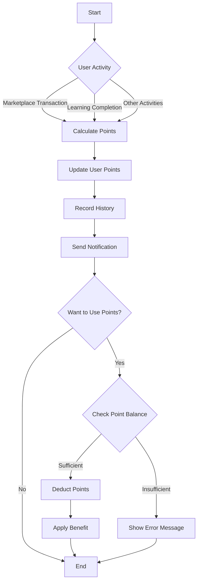
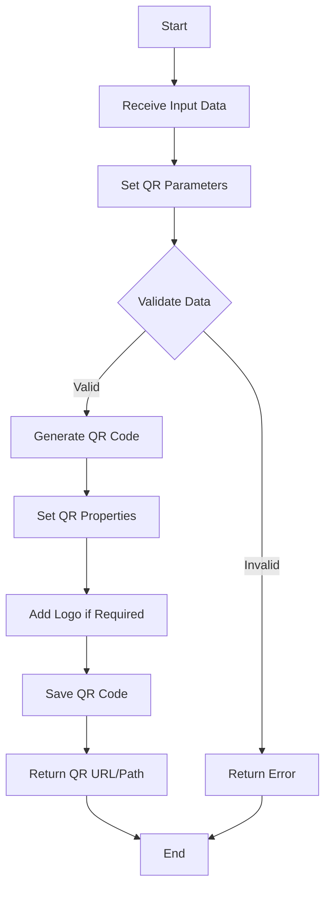
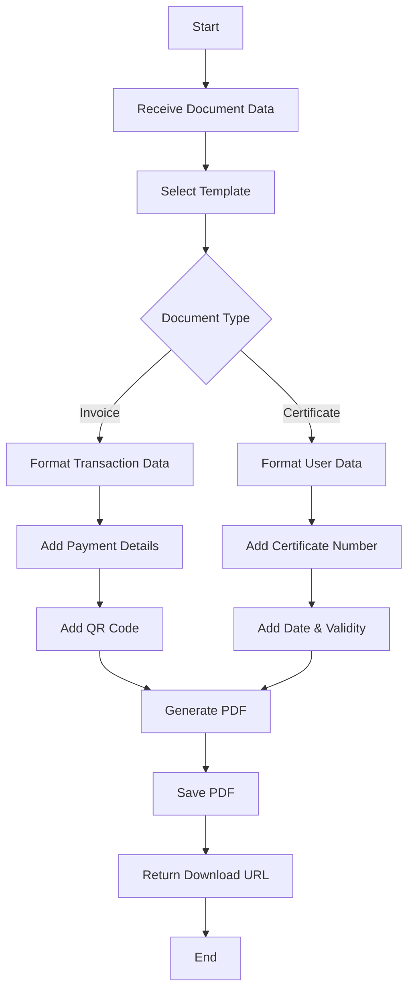
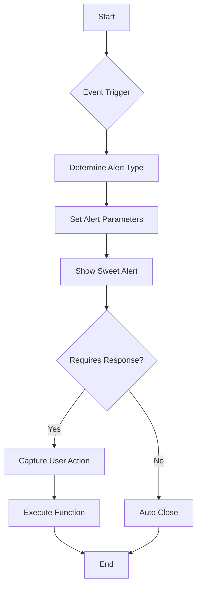
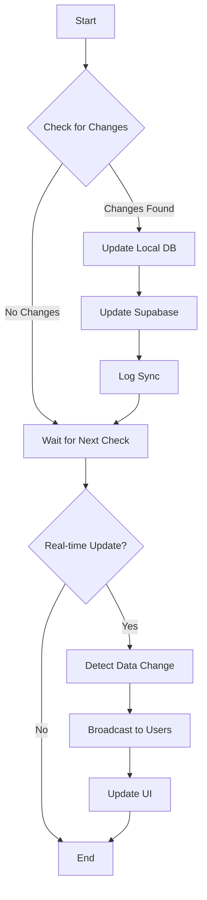

# Flowcharts Fitur Khusus PoinMarket

## 1. Sistem Poin

```mermaid
flowchart TD
    A[Start] --> B{User Activity}
    B -->|Marketplace Transaction| C[Calculate Points]
    B -->|Learning Completion| C
    B -->|Other Activities| C
    C --> D[Update User Points]
    D --> E[Record History]
    E --> F[Send Notification]
    F --> G{Want to Use Points?}
    G -->|Yes| H{Check Point Balance}
    H -->|Sufficient| I[Deduct Points]
    I --> J[Apply Benefit]
    H -->|Insufficient| K[Show Error Message]
    G -->|No| L[End]
    J --> L
    K --> L
```

## 2. QR Code Generation

```mermaid
flowchart TD
    A[Start] --> B[Receive Input Data]
    B --> C[Set QR Parameters]
    C --> D{Validate Data}
    D -->|Valid| E[Generate QR Code]
    E --> F[Set QR Properties]
    F --> G[Add Logo if Required]
    G --> H[Save QR Code]
    H --> I[Return QR URL/Path]
    D -->|Invalid| J[Return Error]
    I --> K[End]
    J --> K
```

## 3. PDF Generation

```mermaid
flowchart TD
    A[Start] --> B[Receive Document Data]
    B --> C[Select Template]
    C --> D{Document Type}
    D -->|Invoice| E[Format Transaction Data]
    D -->|Certificate| F[Format User Data]
    E --> G[Add Payment Details]
    G --> H[Add QR Code]
    F --> I[Add Certificate Number]
    I --> J[Add Date & Validity]
    H --> K[Generate PDF]
    J --> K
    K --> L[Save PDF]
    L --> M[Return Download URL]
    M --> N[End]
```

## 4. Sweet Alert Notification

```mermaid
flowchart TD
    A[Start] --> B{Event Trigger}
    B --> C[Determine Alert Type]
    C --> D[Set Alert Parameters]
    D --> E[Show Sweet Alert]
    E --> F{Requires Response?}
    F -->|Yes| G[Capture User Action]
    G --> H[Execute Function]
    F -->|No| I[Auto Close]
    H --> J[End]
    I --> J
```

## 5. System Integration

```mermaid
flowchart TD
    A[Start] --> B{Check for Changes}
    B -->|Changes Found| C[Update Local DB]
    C --> D[Update Supabase]
    D --> E[Log Sync]
    B -->|No Changes| F[Wait for Next Check]
    E --> F
    F --> G{Real-time Update?}
    G -->|Yes| H[Detect Data Change]
    H --> I[Broadcast to Users]
    I --> J[Update UI]
    G -->|No| K[End]
    J --> K
```
